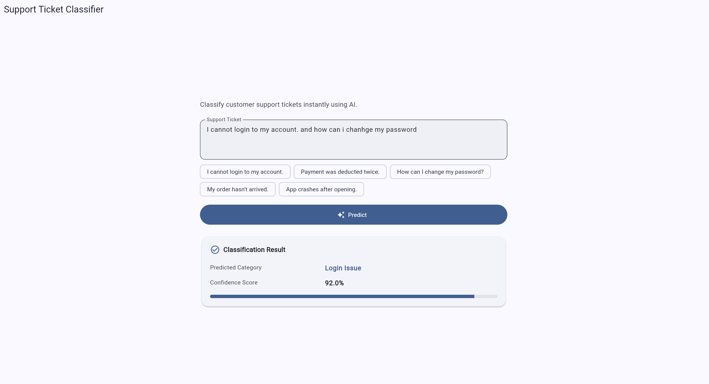

# AI-Powered Support Ticket Classification System

A production-quality full-stack application that classifies customer support tickets into predefined categories using a Large Language Model (LLM). Built with **FastAPI** (Python backend) and **Flutter** (cross-platform frontend).



## Project Overview

Customer support teams receive large volumes of tickets daily. Manual triage is slow and inconsistent. This system uses OpenAI's API as an intelligent classification engine to automatically route tickets into one of six categories:

| Category | Example |
|----------|---------|
| Login Issue | "I cannot login to my account." |
| Payment | "Payment was deducted twice." |
| Account | "How can I change my password?" |
| Delivery | "My order hasn't arrived." |
| Technical Issue | "App crashes after opening." |
| Others | Ambiguous or out-of-scope requests |

---

## Features

- **LLM-based classification** via OpenAI API (no classical ML models)
- **Swappable LLM provider architecture** (OpenAI default; extensible to Gemini, Claude, Groq, Ollama)
- **Prompt engineering** with strict JSON-only responses
- **Confidence threshold rule**: scores below 0.60 → `Others`
- **Retry logic** for transient API failures (timeouts, rate limits)
- **Safe JSON parsing** with graceful handling of malformed responses
- **REST API** with FastAPI (`/classify`, `/health`, `/`)
- **Flutter UI** with loading states, result cards, and error handling
- **Docker & Docker Compose** support
- **Unit tests** with pytest (classification, parsing, endpoints, threshold)
- **Structured logging**, type hints, Pydantic validation

---

## AI Approach

### Why LLM Instead of Classical ML?

| Aspect | LLM Approach | Classical ML (TF-IDF + LR, etc.) |
|--------|--------------|----------------------------------|
| **Flexibility** | Handles varied phrasing, typos, and new intents without retraining | Requires labeled data and retraining for new patterns |
| **Reasoning** | Understands context and nuance (e.g., "charged twice" → Payment) | Relies on keyword/statistical patterns |
| **Maintainability** | Update behavior via prompt changes | Retrain models, manage feature pipelines |
| **Scalability** | API scales horizontally; no model hosting | Self-hosted inference or batch pipelines |
| **Limitations** | Non-deterministic, API dependency, per-request cost | Needs quality training data, weaker on edge cases |
| **Inference Cost** | Pay-per-token (e.g., gpt-4.1-mini is cost-efficient) | Cheaper at very high volume once trained |
| **Latency** | Network round-trip (~0.5–3s typical) | Milliseconds locally |

This project demonstrates **prompt engineering**, **provider abstraction**, and **production error handling** — skills directly applicable to modern AI product engineering.

---

## Project Architecture

```
┌─────────────────┐     HTTP/JSON      ┌──────────────────────────────────┐
│  Flutter App    │ ─────────────────► │  FastAPI Backend                 │
│  (Frontend)     │ ◄───────────────── │  ┌────────────┐  ┌─────────────┐ │
└─────────────────┘                    │  │ API Routes │→ │ Classifier  │ │
                                       │  └────────────┘  │   Service   │ │
                                       │                  └──────┬──────┘ │
                                       │                         │        │
                                       │                  ┌──────▼──────┐ │
                                       │                  │ LLM Service │ │
                                       │                  └──────┬──────┘ │
                                       │                         │        │
                                       │                  ┌──────▼──────┐ │
                                       │                  │   OpenAI    │ │
                                       │                  │  Provider   │ │
                                       │                  └─────────────┘ │
                                       └──────────────────────────────────┘
```

### Backend Layers

1. **API Routes** — HTTP endpoints, request validation, error mapping
2. **Classifier Service** — Business logic (confidence threshold, category validation)
3. **LLM Service** — API calls, retries, provider abstraction
4. **Prompt Templates** — System/user prompts for classification
5. **Utilities** — JSON parsing, retry helpers, logging

### Frontend Layers

1. **Screens** — `HomeScreen` UI orchestration
2. **Widgets** — Reusable `ResultCard`, `ErrorBanner`
3. **Services** — `ApiService` HTTP client (separated from UI)
4. **Models** — `PredictionResult` data class

---

## Folder Structure

```
support-ticket-classifier/
├── backend/
│   ├── app/
│   │   ├── api/
│   │   │   ├── dependencies.py
│   │   │   └── routes.py
│   │   ├── services/
│   │   │   ├── providers/
│   │   │   │   └── openai_provider.py
│   │   │   ├── classifier_service.py
│   │   │   ├── llm_base.py
│   │   │   └── llm_service.py
│   │   ├── prompts/
│   │   │   └── classification_prompt.py
│   │   ├── models/
│   │   │   └── categories.py
│   │   ├── schemas/
│   │   │   └── request_response.py
│   │   ├── utils/
│   │   │   ├── exceptions.py
│   │   │   ├── json_parser.py
│   │   │   ├── logging_config.py
│   │   │   └── retry.py
│   │   ├── config.py
│   │   └── main.py
│   ├── tests/
│   ├── Dockerfile
│   ├── requirements.txt
│   ├── .env.example
│   └── pytest.ini
├── frontend/
│   └── flutter_app/
│       ├── lib/
│       │   ├── main.dart
│       │   ├── models/
│       │   ├── screens/
│       │   ├── services/
│       │   ├── utils/
│       │   └── widgets/
│       └── pubspec.yaml
├── docker-compose.yml
├── LICENSE
├── INSTALL_TRACKER.md
└── README.md
```

---

## Installation

### Prerequisites

- Python 3.11+ (3.12 recommended)
- [Flutter SDK](https://docs.flutter.dev/get-started/install) 3.2+ (for frontend)
- Docker & Docker Compose (optional)
- OpenAI API key

### Backend Setup

```bash
cd support-ticket-classifier/backend

# Create virtual environment
python -m venv .venv

# Activate (Windows PowerShell)
.\.venv\Scripts\Activate.ps1

# Activate (macOS/Linux)
# source .venv/bin/activate

# Install dependencies
pip install -r requirements.txt

# Configure environment
copy .env.example .env   # Windows
# cp .env.example .env   # macOS/Linux

# Edit .env and set your GEMINI_API_KEY and GROQ_API_KEY
```

### Flutter Setup

```bash
cd support-ticket-classifier/frontend/flutter_app

# Generate platform folders (first time only, if missing)
flutter create . --platforms=web,windows,android

flutter pub get
```

---

## Environment Variables

| Variable | Default | Description |
|----------|---------|-------------|
| `GEMINI_API_KEY` | *(required if using Gemini)* | Gemini API key |
| `GEMINI_MODEL` | `gemini-2.0-flash` | Gemini model name |
| `GEMINI_BASE_URL` | *(empty)* | Gemini API base URL (optional) |
| `GROQ_API_KEY` | *(required if Gemini fails and fallback is used)* | Groq API key (starts with `gsk_`) |
| `GROQ_MODEL` | `llama-3.3-70b-versatile` | Groq model name |
| `GROQ_BASE_URL` | *(empty)* | Groq API base URL (optional) |
| `LLM_PROVIDER` | `gemini` | Primary LLM provider (`gemini`, `groq`, or `openai`) |
| `LLM_FALLBACK_PROVIDER` | `groq` | Fallback provider used if the primary fails |
| `PORT` | `8000` | Server port |
| `HOST` | `0.0.0.0` | Server host |
| `CONFIDENCE_THRESHOLD` | `0.60` | Minimum confidence before forcing `Others` |
| `LLM_TIMEOUT_SECONDS` | `30` | API timeout |
| `LLM_MAX_RETRIES` | `3` | Retry attempts for transient failures |
| `LOG_LEVEL` | `INFO` | Logging level |

---

## Running the Backend

### Local (without Docker)

```bash
cd backend
.\.venv\Scripts\Activate.ps1   # Windows
uvicorn app.main:app --host 0.0.0.0 --port 8000 --reload
```

API docs: [http://localhost:8000/docs](http://localhost:8000/docs)

### Docker

```bash
# From project root — ensure backend/.env exists with GEMINI_API_KEY and GROQ_API_KEY
cd support-ticket-classifier
copy backend\.env.example backend\.env
# Edit backend\.env with your Gemini and Groq API keys

docker compose up --build
```

Stop: `docker compose down`

---

## Running the Flutter App

Start the backend first, then:

```bash
cd frontend/flutter_app
flutter pub get
flutter run -d chrome          # Web
flutter run -d windows         # Windows desktop
```

**Android emulator** — use host IP mapping:

```bash
flutter run --dart-define=API_BASE_URL=http://10.0.2.2:8000
```

**Physical device** — use your machine's LAN IP:

```bash
flutter run --dart-define=API_BASE_URL=http://192.168.1.10:8000
```

---

## API Documentation

### `GET /`

Returns API information.

**Response:**
```json
{
  "name": "Support Ticket Classifier API",
  "version": "1.0.0",
  "description": "AI-powered support ticket classification using LLM APIs.",
  "endpoints": {
    "classify": "POST /classify",
    "health": "GET /health",
    "docs": "GET /docs"
  }
}
```

### `GET /health`

**Response:**
```json
{
  "status": "healthy"
}
```

### `POST /classify`

**Request:**
```json
{
  "ticket": "Payment deducted twice."
}
```

**Response:**
```json
{
  "ticket": "Payment deducted twice.",
  "category": "Payment",
  "confidence": 0.95
}
```

**Error responses:**
- `422` — Invalid request (empty ticket)
- `502` — Invalid LLM response
- `503` — LLM service unavailable

---

## Sample Inputs & Expected Outputs

| # | Input Ticket | Expected Category |
|---|--------------|-------------------|
| 1 | I cannot login to my account. | Login Issue |
| 2 | Payment was deducted twice. | Payment |
| 3 | How can I change my password? | Account |
| 4 | My order hasn't arrived. | Delivery |
| 5 | App crashes after opening. | Technical Issue |
| 6 | I want to cancel my subscription and get a refund. | Payment |
| 7 | Please update my delivery address before shipping. | Account |
| 8 | Tracking shows delivered but I never received the package. | Delivery |
| 9 | Two-factor authentication code never arrives. | Login Issue |
| 10 | The search feature returns no results on mobile. | Technical Issue |
| 11 | Great service, just wanted to say thanks! | Others |

**Example API call:**

```bash
curl -X POST http://localhost:8000/classify \
  -H "Content-Type: application/json" \
  -d "{\"ticket\": \"I cannot login to my account.\"}"
```

**Example response:**
```json
{
  "ticket": "I cannot login to my account.",
  "category": "Login Issue",
  "confidence": 0.92
}
```

---

## Running Tests

```bash
cd backend
.\.venv\Scripts\Activate.ps1
pytest -v
```

With coverage:

```bash
pytest --cov=app --cov-report=term-missing
```

**Test coverage includes:**
- Successful classification
- Confidence threshold (< 0.60 → Others)
- Invalid API / malformed JSON responses
- JSON parsing utilities
- `/classify`, `/health`, `/` endpoints
- LLM retry behavior

---

## Assumptions

1. Tickets are written in **English** (single-language input).
2. Each ticket maps to **exactly one** primary category.
3. OpenAI API key is valid and has access to the configured model.
4. Network connectivity to OpenAI is available when not using mocks.
5. Ticket text is plain text (no attachments or rich media).
6. Confidence threshold of **0.60** is an acceptable business default.
7. Flutter app and backend run on the same network (or emulator host mapping).

---

## Limitations

- **Non-deterministic** — Same ticket may yield slightly different confidence scores.
- **API latency** — Depends on OpenAI response time and network.
- **Cost** — Each classification incurs token usage charges.
- **No persistence** — Tickets are not stored in a database.
- **No authentication** — API is open (suitable for demo, not production as-is).
- **Single-turn** — No conversation history or multi-message context.
- **English only** — No multi-language support in the current prompt.

---

## Future Improvements

- Multi-language ticket support
- Conversation history and thread-aware classification
- Fine-tuned or smaller local models (Ollama) for offline/low-cost inference
- API authentication (API keys, OAuth2)
- Analytics dashboard for category distribution
- Database storage for tickets and audit logs
- User accounts and role-based access
- Human feedback loop for continuous prompt refinement
- Additional LLM providers (Gemini, Claude, Groq) via provider plugins
- Batch classification endpoint
- Rate limiting and request queuing

---

## License

This project is licensed under the [MIT License](LICENSE).

---

## Storage Cleanup

See [INSTALL_TRACKER.md](INSTALL_TRACKER.md) for a list of installed artifacts and cleanup commands to reclaim disk space after completing the assignment.
